# Documentación de Arquitectura - T01 (Enfoque Exclusivo en Registro)

**Historia de Usuario:** HU01: “Registro de Cuenta Gratuita (Sandbox)”  
**Sprint:** Sprint 1  
**Tecnologías:** Angular (Frontend) y Spring Boot (Backend)

Este documento detalla el diseño arquitectónico de clases exclusivamente para el módulo de **aprovisionamiento de Sandbox y registro de cuenta gratuita** del sistema **SmartDesk** (SaaS B2B). Se aborda la creación del usuario (`User`) y su asociación inicial con un entorno aislado (`Tenant`), dividiendo el proceso en dos pasos para validar el correo y prevenir el abuso de recursos.

*(Nota: Los artefactos de autenticación, inicio de sesión, JWT y control de sesión se abordarán en la HU05 - Control de Sesión Universal, de acuerdo con el Product Backlog).*

## Diagrama de Clases (Mermaid)

```mermaid
classDiagram
    %% ==========================================
    %% CAPA FRONTEND (ANGULAR)
    %% ==========================================
    namespace Frontend_Angular {
        class LandingPageComponent {
            <<Component>>
        }

        class RegisterComponent {
            <<Component>>
            -userForm : FormGroup
            -authService : AuthService
            +ngOnInit()
            +onSubmit() void
            -checkEmailAsync() AsyncValidatorFn
        }

        class VerifyComponent {
            <<Component>>
            -activationForm : FormGroup
            -authService : AuthService
            +ngOnInit()
            +onSubmit() void
        }

        class AuthService {
            <<Injectable Service>>
            -http : HttpClient
            -apiUrl : string
            +initRegistration(user: InitRegistrationDTO_TS) Observable~Response~
            +activateTenant(data: ActivationDTO_TS) Observable~UserResponse~
        }

        class InitRegistrationDTO_TS {
            <<Interface / Type>>
            +nombres: string
            +email: string
            +password: string
        }

        class ActivationDTO_TS {
            <<Interface / Type>>
            +token: string
            +companyName: string
        }
    }

    %% Relaciones Frontend
    LandingPageComponent --> RegisterComponent : Redirige a
    RegisterComponent --> AuthService : Inyecta
    VerifyComponent --> AuthService : Inyecta
    RegisterComponent ..> InitRegistrationDTO_TS : Usa
    VerifyComponent ..> ActivationDTO_TS : Usa

    %% ==========================================
    %% LÍMITE DE RED (HTTP / REST)
    %% ==========================================
    AuthService ..> AuthController : POST /api/v1/auth/register (JSON)
    AuthService ..> AuthController : POST /api/v1/auth/activate (JSON)

    %% ==========================================
    %% CAPA BACKEND (SPRING BOOT)
    %% ==========================================
    namespace Backend_SpringBoot_Controllers {
        class AuthController {
            <<RestController>>
            -registrationService : RegistrationService
            +initRegistration(dto: InitRegistrationDTO) ResponseEntity
            +activateTenant(dto: ActivationDTO) ResponseEntity~UserResponse~
        }
        
        class GlobalExceptionHandler {
            <<RestControllerAdvice>>
            +handleEmailAlreadyExists(ex: EmailAlreadyExistsException) ResponseEntity
            +handleValidationErrors(ex: MethodArgumentNotValidException) ResponseEntity
        }
    }

    namespace Backend_SpringBoot_DTOs {
        class InitRegistrationDTO {
            <<DTO>>
            +nombres: String
            +email: String
            +password: String
        }
        
        class ActivationDTO {
            <<DTO>>
            +token: String
            +companyName: String
        }
        
        class UserMapper {
            <<MapStruct Interface>>
            +toEntity(dto: InitRegistrationDTO) User
            +toResponseDto(entity: User) UserResponse
        }
    }

    namespace Backend_SpringBoot_Services {
        class RegistrationService {
            <<Service>>
            -userRepository : UserRepository
            -passwordEncoder : BCryptPasswordEncoder
            -mapper : UserMapper
            -tenantService : TenantService
            -roleAssignmentService : RoleAssignmentService
            -emailNotificationService : EmailNotificationService
            -tokenRepository: VerificationTokenRepository
            +initRegistration(dto: InitRegistrationDTO) void
            +activateTenant(dto: ActivationDTO) UserResponse
            -validateUniqueEmail(email: String) void
        }
        
        class TenantService {
            <<Service>>
            +createSandboxTenant(companyName: String) Tenant
        }
        
        class RoleAssignmentService {
            <<Service>>
            +assignAdminRole(user: User, tenant: Tenant) void
        }
        
        class EmailNotificationService {
            <<Service>>
            +sendVerificationEmail(user: User, token: VerificationToken) void
        }
    }

    namespace Backend_SpringBoot_Persistence {
        class UserRepository {
            <<JpaRepository>>
            +findByEmail(email: String) Optional~User~
            +save(user: User) User
        }

        class VerificationTokenRepository {
            <<JpaRepository>>
            +findByToken(token: String) Optional~VerificationToken~
            +save(token: VerificationToken) VerificationToken
        }

        class User {
            <<Entity>>
            -id : UUID
            -nombres : String
            -email : String
            -password : String
            -isActive : Boolean
            -createdAt : LocalDateTime
        }
        
        class Tenant {
            <<Entity>>
            -id : UUID
            -name : String
            -planType : String
        }
        
        class UserTenantRole {
            <<Entity>>
            -id : UUID
            -user : User
            -tenant : Tenant
            -role : String
        }
        
        class VerificationToken {
            <<Entity>>
            -id : UUID
            -token : String
            -user : User
            -expiryDate : LocalDateTime
        }
    }

    %% Relaciones Backend
    AuthController --> RegistrationService : Inyecta
    AuthController ..> InitRegistrationDTO : Recibe (@Valid)
    AuthController ..> ActivationDTO : Recibe (@Valid)
    
    RegistrationService --> UserRepository : Inyecta
    RegistrationService --> VerificationTokenRepository : Inyecta
    RegistrationService --> UserMapper : Inyecta
    RegistrationService --> BCryptPasswordEncoder : Inyecta
    RegistrationService --> TenantService : Inyecta
    RegistrationService --> RoleAssignmentService : Inyecta
    RegistrationService --> EmailNotificationService : Inyecta
    RegistrationService ..> EmailAlreadyExistsException : Lanza
    
    UserMapper ..> User : Transforma a
    UserMapper ..> InitRegistrationDTO : Transforma desde
    
    UserRepository ..> User : Gestiona persistencia
    VerificationTokenRepository ..> VerificationToken : Gestiona persistencia
```

## Descripción de Componentes Clave

Esta arquitectura se centra estrictamente en el flujo de registro de 2 pasos (HU01). A continuación, se detallan los elementos que conforman este diagrama:

1. **Capa Frontend (Angular):**
   - `LandingPageComponent`: Actúa como punto de entrada comercial de la aplicación y enruta al usuario hacia el flujo de registro.
   - `RegisterComponent`: Maneja la vista del primer paso del registro (Init) y utiliza validaciones asíncronas para verificar la disponibilidad del correo electrónico. Recolecta nombres, email y contraseña.
   - `VerifyComponent`: Maneja la vista del segundo paso de registro (Activación). Se accede a través de un enlace enviado al correo electrónico. Recibe el token y solicita el nombre de la empresa para aprovisionar el Sandbox.
   - `AuthService`: Expone los métodos `initRegistration()` y `activateTenant()`, encargados de realizar las peticiones HTTP POST hacia el backend.
   - `InitRegistrationDTO_TS` y `ActivationDTO_TS`: Interfaces de TypeScript que aseguran el tipado estricto de los datos enviados en cada paso del proceso de registro.
2. **Capa de Controladores (Spring Boot):**
   - `AuthController`: Expone los endpoints públicos de registro (`/api/v1/auth/register` y `/api/v1/auth/activate`), recibiendo los DTOs estructurados.
   - `GlobalExceptionHandler`: Captura errores de negocio (como intentar registrar un correo que ya existe o tokens inválidos) y errores de validación del formulario, devolviendo respuestas HTTP consistentes.
3. **Capa de Servicios y Lógica de Negocio:**
   - **Step 1 (Init):** En el método `initRegistration()` de `RegistrationService`, el sistema valida la unicidad del correo electrónico, crea el usuario inicial inactivo y su `VerificationToken`, y dispara el envío del correo con el enlace de verificación mediante `EmailNotificationService`. **No se crea** ningún entorno Sandbox ni se asignan roles durante este paso para prevenir el spam.
   - **Step 2 (Activation):** En el método `activateTenant()` de `RegistrationService`, se valida el token recibido. Si el token es válido, el sistema marca al usuario como activo (`isActive = true`). En este punto, utilizando los datos de `ActivationDTO` (como el nombre de la empresa), el servicio orquesta la creación del entorno aislado usando `TenantService` y asigna el rol de "Administrador de Empresa" (`RoleAssignmentService`). Este flujo en dos fases asegura que solo usuarios verificados consuman recursos de base de datos para crear tenants.
   - `BCryptPasswordEncoder` y `UserMapper` apoyan cifrando contraseñas y convirtiendo DTOs, respectivamente.
4. **Capa de Persistencia:**
   - `UserRepository` y `VerificationTokenRepository`: Repositorios JPA que proporcionan persistencia y consultas específicas.
   - Entidades Físicas:
     - `User`: Mapea la tabla de usuarios, ahora incluyendo el atributo de control de acceso `isActive`.
     - `Tenant`: Representa el entorno de trabajo empresarial aislado o Sandbox del usuario.
      - `UserTenantRole`: Entidad asociativa entre un usuario, su tenant y su rol.
      - `VerificationToken`: Almacena el token único para la activación de cuentas, asociado a un `User` específico.

## Mapeo de Tareas de Desarrollo (Notion)

Este mapeo relaciona las tareas de implementación de Notion con los componentes arquitectónicos definidos en este documento. El **RegistrationService** actúa como el servicio orquestador principal que integra las responsabilidades de T04, T05 y T06.

* **T04: Desarrollo Backend (Core de Seguridad)**
  * **Componentes:** `AuthController.initRegistration()`, `InitRegistrationDTO`, `User`, `UserRepository`, `UserMapper`.
  * **Integración:** El `RegistrationService` coordina la creación del usuario inicial inactivo validando que no exista un correo duplicado.
* **T05: Desarrollo Backend (Mensajería)**
  * **Componentes:** `VerificationToken`, `VerificationTokenRepository`, `EmailNotificationService`.
  * **Integración:** El `RegistrationService` genera el token de verificación y utiliza el `EmailNotificationService` para enviar el correo al usuario tras su registro inicial.
* **T06: Desarrollo Backend (Activación)**
  * **Componentes:** `AuthController.activateTenant()`, `ActivationDTO`, `Tenant`, `TenantService`, `UserTenantRole`, `RoleAssignmentService`.
  * **Integración:** El `RegistrationService` valida el token y orquesta la activación del usuario, la creación del Tenant (`TenantService`) y la asignación del rol de administrador (`RoleAssignmentService`).
* **T07: Desarrollo Frontend**
  * **Componentes:** `LandingPageComponent`, `RegisterComponent`, `VerifyComponent`, `AuthService`, `InitRegistrationDTO_TS`, `ActivationDTO_TS`.
  * **Descripción:** Implementación de las vistas y servicios en Angular que consumen los endpoints de T04 y T06.

