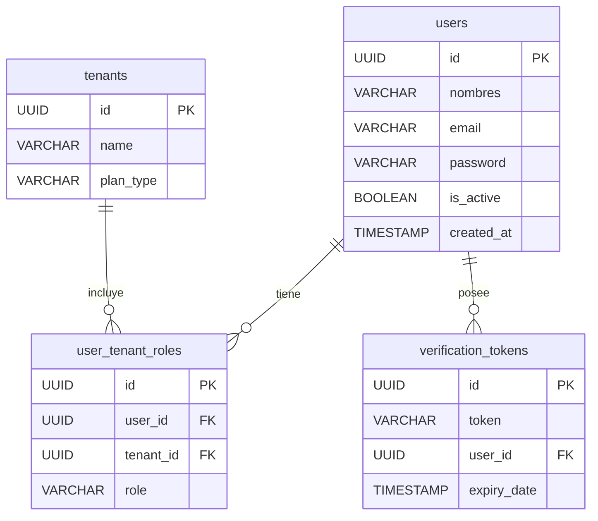

# Diseño de Base de Datos - T02

**Historia de Usuario:** HU01: “Registro de Cuenta Gratuita (Sandbox)”
**Tarea:** T02: Diseño de Base de Datos

Este documento presenta el Diagrama Entidad-Relación (ERD) físico para el módulo de registro y aprovisionamiento de Sandbox. Las tablas están diseñadas para soportar el flujo de registro en dos pasos (Init y Activación) y el modelo de inquilinos (Tenants).

## Diagrama Entidad-Relación (ERD)

## Descripción de las Tablas y Soporte al Proceso de Registro

*   **`users`**: Almacena la información de los usuarios del sistema. Durante el primer paso del registro (Init), se crea un registro en esta tabla con `is_active = false` para asegurar que el usuario ha verificado su correo electrónico antes de permitir el acceso a los recursos.
*   **`verification_tokens`**: Mantiene los tokens de activación enviados por correo electrónico. Cada token está asociado a un usuario inactivo en la tabla `users` a través de la clave foránea `user_id`. Esto permite validar de forma segura el segundo paso del registro.
*   **`tenants`**: Representa los entornos aislados o "Sandbox". Un registro en esta tabla sólo se crea durante el segundo paso del registro (Activación), una vez que el usuario proporciona un token válido y el nombre de su empresa. Esto previene la creación masiva de inquilinos por parte de bots o correos no verificados.
*   **`user_tenant_roles`**: Tabla asociativa que vincula a un usuario (`users`) con un inquilino (`tenants`) y define su rol (`role`). Durante la activación del entorno Sandbox, se inserta un registro asignando el rol de "Administrador" al usuario que acaba de validar su correo y creado la empresa.
